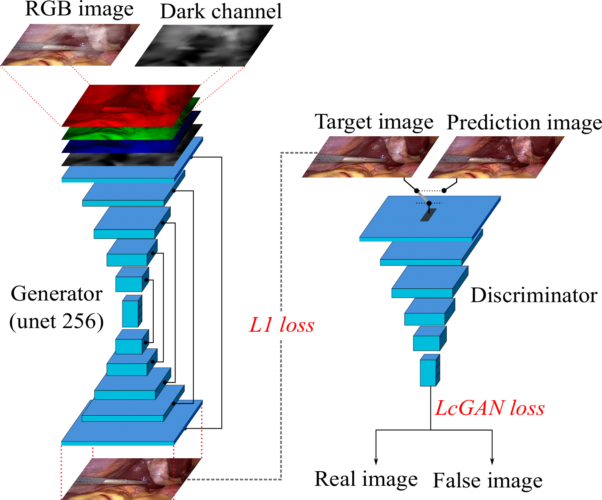

# Desmoking laparoscopy surgery images using an image-to-image translation guided by an embedded Dark channel

## Abstract

In laparoscopic surgery, image quality can be severely degraded by smoke caused by the use of dissection tools and $CO_2$ reducing the visibility of the observed organs and tissues. This lack of visibility increases the possibility of mistakes and surgery time with negative consequences on the patient's health. In this paper, a novel computational approach to remove the smoke effects is introduced. The proposed method is based on an Image-to-Image conditional generative adversarial network in which the dark channel is used as an embedded guide mask. Obtained experimental results are evaluated and compared quantitatively with other desmoking and dehazing state-of-art methods using the metrics of the Peak Signal-to-Noise Ratio (PSNR) and Structural Similarity (SSIM) index. Based on these metrics, it is found that the proposed algorithm has improved performance compared to the state-of-the-art.
Moreover, the time processing required by the proposed method of 92 fps showed that it can be applied to real-time medical systems, and even in an embedded device.

## Sample animation result 
##### (Give click to animation...)

## Neural network

## Requeriments

* python                    3.7.6
* numpy                     1.17.5 
* numpy-base                1.18.1 
* pytorch                   1.4.0
* torchvision               0.5.0 
* opencv                    3.4.2           
* opencv-contrib-python     4.1.2.30
* pandas                    0.25.3 
* natsort                   6.2.0 
* pytest-shutil             1.7.0

## How to test

* Download the pretrained model from

> - https://drive.google.com/file/d/1ja-BjV4mGraw7FpsnYAOS2xXDIJ5RD12/view?usp=sharing

* Place best_net_G.pth in
> - ./scripts/checkpoints/pix2pix_laparoscopy_dc/

* Place the input laparoscopic images

> - path='./img_test/input/'

* Run test_img as

> - python test_img.py

* The results will be saved in

> - path='./img_test/output/'

## How to train

* Place the input in
> - path='./datasets/laparoscopy/input/'
* Place the target in
> - path='./datasets/laparosopy/output/'
* Run
> - cd '/scripts/'
> - ./laparoscopy_run_train.sh

* Checkpoints will be saved in
> - ./scripts/checkpoints/pix2pix_laparoscopy_dc/

## Reference

If this code is useful for you please consider citing our work appropriately . Thanks :)

> - Paper in revision...

## Contact

For more questions, please feel free to contact us

* sebastian.salazar@cio.mx
* hugoamj@gmail.com
* cesarortiz1983@gmail.com 
* gflores@cio.mx

*The demonstrative video and used images were acquired from Cholec 80 dataset. http://camma.u-strasbg.fr/datasets

*The code is based on https://github.com/DLHacks/pix2pix_PAN

